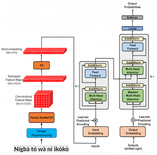

# OCR For Low Resource Languages

This work is an adaptation of CNN+Transformer architecture to training text recognition models for Yorùbá & Igbo.

## Architecture




## Setup

- Clone the github repository
    ```
    $ git clone https://github.com/ToluClassics/LowResourceOCR.git
    ```
- Create a virtual environment and install dependencies
    ```
    $ python2 -m venv venv 
    $ (venv) pip install -r requirements.txt
    ```
- Download TextRecognition Model from google drive
    - Igbo : Download link
    - Yorùbá : Download link

- Run Inference:

    

    ```
    python3 inference.py --lang igbo 
        --image_path samples/igbo_sample.jpg 
        --checkpoint_path run/checkpoint_weights_igbo_trdg.pt
    ```
    ### Output

    ```
    [INFO] Load pretrained model
    [INFO] Predicted text is: tụ n'anya alo afọ ụsụsụ gụzụ aka igụ
    ```

## Reference::

-  Scene Text Recognition via Transformer, [Paper](https://arxiv.org/abs/2003.08077)